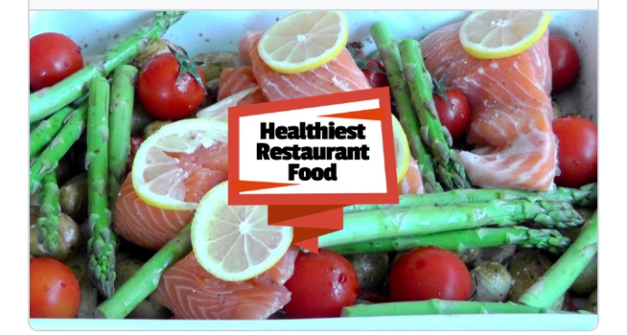

# Food Delivery Website [](https://twitter.com/intent/tweet?text=Bootstrap%20based%food%20&via=froala&hashtags=bootstrap,design,templates,blocks,developers)

Food Ordering Website

## Setup 

clone the website run 

# ``npm install``

```<link rel="stylesheet" href="node_modules/bootstrap/dist/css/bootstrap.min.css">```


Including the jquery and bootstrap javascripts


```<script src="node_modules/jquery/dist/jquery.slim.min.js"></script>```


```<script src="node_modules/popper.js/dist/umd/popper.min.js"></script>```


 ```<script src="node_modules/bootstrap/dist/js/bootstrap.min.js"></script>```


Documentation/Demo

You can access a live demo of the Food Delivery Website here. 
https://lomsey41.github.io/Food-Delivery-Website/
 
FOOD DELIVERY WEBSITE PICTURE PREVIEW:
 




Description

The Food Delivery Website is a static website that allows users to browse and order food from various restaurants. It provides a convenient and user-friendly interface for users to explore different food options, customize their orders, and make payments. This website is designed to streamline the process of ordering food online and provide a delightful experience for users.


Installation

To set up the Food Delivery Website locally, follow these steps:

    Clone the repository: git clone https://github.com/lomsey41/food-delivery-website.git
    Navigate to the project directory: cd food-delivery-website
    Open the index.html file in your preferred web browser.


User Stories

    As a user, I want to browse different restaurants and their menus.
    As a user, I want to search for specific dishes or cuisines.
    As a user, I want to view detailed information about each dish, including prices and ingredients.
    As a user, I want to add items to my cart and customize them as per my preferences.
    As a user, I want to proceed to checkout and make payments securely.
    As a user, I want to track the status of my order and receive updates.
    As a user, I want to provide feedback and ratings for the food and service.


Mockups

Homepage Mockup
Restaurant Menu Mockup
Cart Mockup
Checkout Mockup
Order Tracking Mockup


Support/Contribution

If you encounter any issues or have suggestions for improvement, please feel free to open an issue or submit a pull request on the GitHub repository. Your contributions are highly appreciated!


Used Languages/Framework/Solutions

The Food Delivery Website is built using the following technologies:

    HTML5: Provides the structure and semantic markup of the website.
    CSS3: Handles the styling and layout of the website.
    JavaScript: Enables interactivity and dynamic functionality.
    Bootstrap: Utilized for responsive design and pre-built components.
    jQuery: Used for DOM manipulation and event handling.


Used Packages

The Food Delivery Website utilizes the following packages:

1. jQuery: A fast and concise JavaScript library that simplifies HTML document traversing, event handling, and animating.
2. Bootstrap: A popular CSS framework that provides responsive design and pre-built components for building websites.


Future Deployment Plan

In the future, the Food Delivery Website can be further enhanced with the following features:

    User account creation and management.
    Integration with popular payment gateways for seamless transactions.
    Real-time order tracking using GPS technology.
    Integration with restaurant management systems for automatic order processing.
    Mobile application development for both iOS and Android platforms.
    
    TABLE OF CONTENTS
Purpose
The drive behind building a food delivery website came due to a growing demands for food delivery services, driven by busy lifestyles and convenience-seeking customer. Hence helping to alleviate the stress of discerning busy individuals to balance their eating habit and stay healthy.

Moreover, it will provides a convenient and user-friendly interface for users to explore different food options, customize their orders, make payments and get their orders delivered faster to their doorsteps. behind building a food delivery website

As the Author of this project : Salome Bassey. I worked alone as a team and this is a portfolio project for Holberton school.

Description
The Food Delivery Website is a static website that allows users to browse and order food from various restaurants. It provides a convenient and user-friendly interface for users to explore different food options, customize their orders, and make payments. This website is designed to streamline the process of ordering food online and provide a delightful experience for users.

Website Features
User Registration and Authentication: Allow users to create accounts and log in using their email, social media accounts, or mobile numbers.

Online Menu: Present a user-friendly menu that showcases the variety of dishes and beverages offered by each restaurant. Include item descriptions, prices, and customizable options if applicable.

Ordering System: Allow users to add items to their cart, customize their orders, and specify delivery or pickup preferences (e.g., delivery address, date, and time). Implement a seamless checkout process.

My Story
I'm a passionate food enthusiast, when i, noticed a growing demand for convenient meal options. Inspired by this, I decided to create a food delivery website that connect busy individuals with their favorite local restaurants. The website quickly gained popularity, delivering mouthwatering meals straight to people's homes, making dining a hassle-free and delightful experience


Conclusion

The Food Delivery Website aims to revolutionize the way users order food online. By providing an intuitive interface, extensive restaurant options, and seamless ordering process, it offers a delightful experience to users. Feel free to explore the live demo or contribute to its development to make it even better!

License : MIT


Author: Salome Bassey<Github.com/lomsey41>/twitter<lomsey41>
Linkedin: http://www.linkedin.com/in/salome-bassey
 
Blog post : https://lomsey41.hashnode.dev/food-delivery-website


Appreciation to: Nathaniel Emenike
